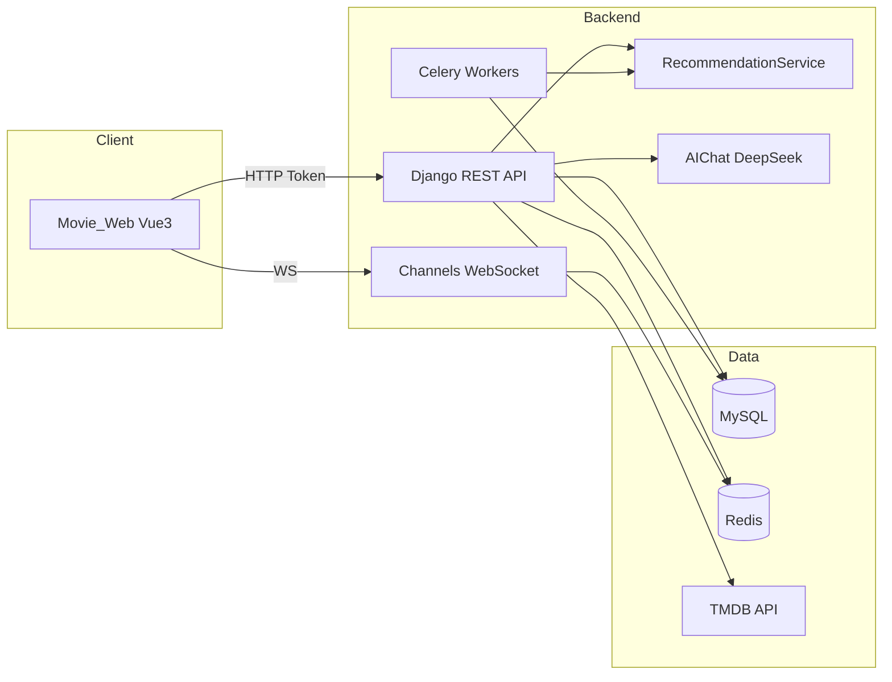

# Movie recommendation system

基于 **深度学习 + 大语言模型（LLM）** 的全栈电影 Web 应用，集成电影浏览、个性化推荐、社区论坛、在线购票与后台管理。前端采用 Vue 3，后端采用 Django REST Framework，推荐模块支持 TensorFlow 神经协同过滤与 DeepSeek 对话式推荐。

---

## 功能概览

### 用户端（Movie_Web）

| 模块 | 功能说明 |
|------|----------|
| 首页与片库 | TMDB 数据代理：轮播、正在热映、高分榜、热门电影无限滚动 |
| 电影详情 | 影片信息、评分评论、收藏、互动统计 |
| 个性化推荐 | 基于用户评论/收藏的深度学习推荐列表 |
| AI 推荐 | LLM 对话式电影推荐与 AI 聊天（DeepSeek API） |
| 搜索与排行 | 关键词搜索、排行榜展示 |
| 个人中心 | 资料编辑、头像、积分、设置、年度报告 |
| 收藏夹 | 电影收藏与个人片单 |
| 论坛社区 | 发帖、回复、点赞、收藏、热门帖、主题筛选、通知 |
| 在线购票 | 影院场次查询、选座下单、订单列表与详情 |
| 视频播放 | HLS 流媒体播放页 |
| 实时通知 | WebSocket 推送论坛/系统通知 |

### 管理后台（`/admin`）

支持 **超级管理员** 与 **分角色管理员**（电影 / 论坛 / 订单），按角色展示不同菜单：

| 子模块 | 功能说明 |
|--------|----------|
| 仪表盘 | 用户、电影、评论、订单等核心指标与活动动态 |
| 用户管理 | 用户列表、启用/禁用、角色分配、删除 |
| 电影管理 | 影片 CRUD、TMDB 同步、数据导出 |
| 评论管理 | 审核、批量操作、状态切换 |
| 论坛管理 | 帖子审核（通过/拒绝）、置顶、全量帖子列表 |
| 订单管理 | 票务订单查看与处理 |
| 数据分析 | 用户增长、活跃度、业务统计图表 |
| 系统运维 | 配置版本、备份、日志、缓存清理、健康检查 |

### 后端能力（Movie_demo）

- RESTful API + Token 认证
- MySQL 持久化，Redis 缓存与 Channels 消息层
- Celery 异步任务（定时训练、数据同步等）
- 推荐模型训练命令与离线评估（Hit@K、NDCG@K 等）
- TMDB 第三方电影元数据代理
- 分级权限：`IsSuperAdmin`、`IsMovieAdmin`、`IsForumAdmin`、`IsOrderAdmin`

---

## 技术栈

| 层级 | 技术 |
|------|------|
| 前端 | Vue 3、Vue Router、Pinia、Vite、Element Plus、ECharts、Axios、HLS.js |
| 后端 | Django 4.2、Django REST Framework、Channels、Celery |
| 数据 | MySQL、Redis |
| 推荐 | TensorFlow/Keras（神经协同过滤）、scikit-learn、KMeans 聚类 |
| AI | DeepSeek API、tmdbsimple |
| 其他 | python-dotenv、django-cors-headers、django-redis |

---

## 项目结构

```
BS/
├── Movie_demo/                 # Django 后端
│   ├── Movie_demo/             # 项目配置（settings、urls、asgi、celery）
│   ├── movies/                 # 电影、评论、推荐、影院、订单
│   ├── users/                  # 用户、论坛、通知、管理 API
│   ├── core/                   # 管理路由聚合
│   ├── models/                 # 训练好的推荐模型（运行后生成）
│   ├── logs/                   # 系统与推荐日志
│   ├── manage.py
│   └── evaluate_model.py       # 推荐模型离线评估脚本
│
└── Movie_Web/                  # Vue 3 前端
    ├── src/
    │   ├── api/                # 接口封装
    │   ├── views/              # 页面视图
    │   ├── views/admin/        # 管理后台页面
    │   ├── components/         # 通用与业务组件
    │   ├── router/             # 路由与守卫
    │   └── stores/             # Pinia 状态
    ├── vite.config.js          # 开发代理 → localhost:8000
    └── package.json
```

---

## 系统架构



---

## 环境要求

- **Node.js** ≥ 18
- **Python** ≥ 3.8
- **MySQL** 8.x（默认库名 `movie`，端口可按 `settings.py` 修改）
- **Redis**（缓存 `6379/1`、Channels `6379/0`、Celery Broker）
- （可选）**TensorFlow**，用于深度学习推荐；未安装时部分能力会降级

---

## 快速开始

### 1. 克隆仓库

```bash
git clone <your-repo-url>
cd BS
```

### 2. 后端（Movie_demo）

```bash
cd Movie_demo

# 建议使用虚拟环境
python -m venv venv
# Windows
venv\Scripts\activate
# macOS / Linux
# source venv/bin/activate

pip install -r requirements.txt
```

创建 MySQL 数据库（示例）：

```sql
CREATE DATABASE movie CHARACTER SET utf8mb4 COLLATE utf8mb4_unicode_ci;
```

按需修改 `Movie_demo/settings.py` 中的数据库连接，或通过环境变量覆盖敏感配置：

| 变量名 | 说明 |
|--------|------|
| `DEEPSEEK_API_KEY` | DeepSeek API，用于 LLM 推荐与 AI 聊天 |
| `TMDB_API_KEY` | [TMDB](https://www.themoviedb.org/settings/api) 电影数据 |

```bash
# 数据库迁移
python manage.py migrate

# 创建超级用户（管理后台登录）
python manage.py createsuperuser

# （可选）生成影院场次等测试数据
python manage.py create_test_data

# 启动开发服务器
python manage.py runserver
```

**推荐模型训练（可选）：**

```bash
python manage.py train_recommendation_model --epochs 10
# 强制重训
python manage.py train_recommendation_model --force

# 离线评估 Hit@K / NDCG@K
python evaluate_model.py
```

**异步任务（可选）：**

```bash
# 另开终端
celery -A Movie_demo worker -l info
celery -A Movie_demo beat -l info
```

**WebSocket（实时通知，可选）：**

```bash
# 需 Redis 与 channels 配置就绪
daphne -b 0.0.0.0 -p 8001 Movie_demo.asgi:application
```

### 3. 前端（Movie_Web）

```bash
cd Movie_Web
npm install
npm run dev
```

浏览器访问：**http://localhost:5173**

Vite 已将 `/api` 代理到 `http://localhost:8000`（见 `vite.config.js`）。生产构建：

```bash
npm run build
npm run preview
```

### 4. 默认接口前缀

| 前缀 | 说明 |
|------|------|
| `http://localhost:8000/api/users/` | 注册、登录、资料、论坛、管理 |
| `http://localhost:8000/api/` | 电影、推荐、评论、影院、订单 |
| `http://localhost:8000/media/` | 用户头像、帖子图片等媒体文件 |

认证方式：请求头 `Authorization: Token <your_token>`

---

## 推荐系统说明

系统采用 **混合推荐策略**：

1. **深度学习推荐**（`RecommendationService`）  
   - 基于用户评论、收藏等行为构建特征  
   - TensorFlow Embedding 模型进行协同过滤  
   - 支持 KMeans 聚类与冷启动默认特征  
   - 模型文件保存在 `Movie_demo/models/`

2. **LLM 对话推荐**（`AIChatRecommender`）  
   - 接入 DeepSeek，结合对话历史做口语化推荐  
   - 单次最多推荐 3 部，可联动 TMDB 检索影片详情  

3. **评估与监控**  
   - `evaluate_model.py`：留一法离线评估 Hit@K、NDCG@K 等  
   - `logs/recommendations.log`：推荐请求与命中日志  

---

## 管理员角色

| 角色字段 `admin_role` | 权限范围 |
|----------------------|----------|
| `user` | 普通用户 |
| `movie_admin` | 电影、评论相关管理 |
| `forum_admin` | 论坛帖子审核与管理 |
| `order_admin` | 订单与票务管理 |
| Django `is_superuser` | 全部管理功能 |

前端路由 `meta.requiresAdmin` 与 `AdminLayout` 会按角色过滤可见菜单；越权访问将跳转 403 页面。

---

## 主要 API 一览

> 完整接口说明可参考 `Movie_demo/接口静态测试.md`

**用户 / 论坛**

- `POST /api/users/login/` — 登录获取 Token  
- `POST /api/users/register/` — 注册  
- `GET/PATCH /api/users/profile/` — 个人资料  
- `GET/POST /api/users/posts/` — 帖子列表与创建  
- `GET /api/users/notifications/` — 通知列表  
- `GET /api/users/yearly-report/` — 年度报告  

**电影 / 推荐 / 票务**

- `GET /api/movies/tmdb/` — TMDB 代理  
- `GET /api/movies/<id>/` — 电影详情  
- `GET /api/recommend/` — 个性化推荐  
- `POST /api/llm/recommend/`、`POST /api/llm/chat/` — LLM 推荐与聊天  
- `GET /api/cinemas/`、`GET /api/schedules/` — 影院与场次  
- `POST /api/orders/` — 创建订单  

**管理**

- `GET /api/users/admin/dashboard/` — 仪表盘  
- `GET /api/users/admin/users/` — 用户管理  
- `GET /api/admin/movies/` — 电影管理  
- `GET /api/admin/reviews/` — 评论管理  

---

## 开发说明

- 后端 `DEBUG = True` 时请勿将真实 API Key 提交到公开仓库，请使用环境变量或本地 `.env`（需自行创建，并已加入忽略规则）。  
- 首次运行推荐功能前，建议先积累一定用户评论/收藏数据，或执行 `create_test_data` 与模型训练命令。  
- 前端 `localStorage.authToken` 存储登录 Token，路由守卫对需登录页面自动跳转登录页。  

---

## 许可证

本项目仅供学习与研究使用。部署到生产环境前请更换 `SECRET_KEY`、数据库密码与第三方 API 密钥，并关闭 `DEBUG`。

